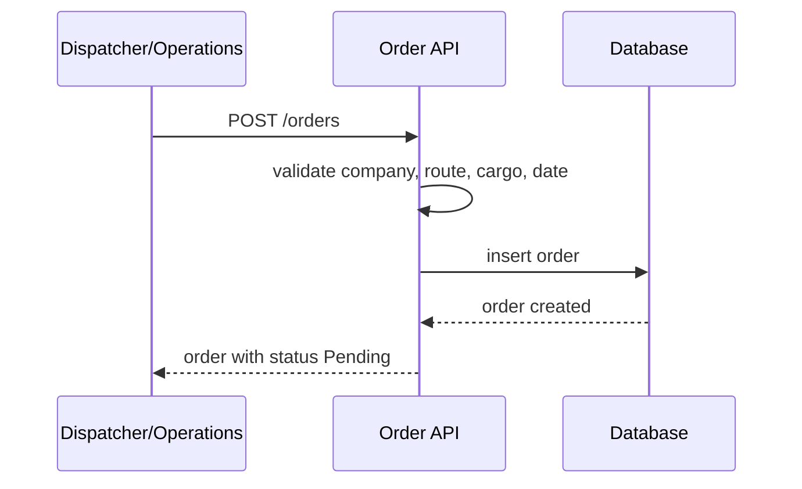
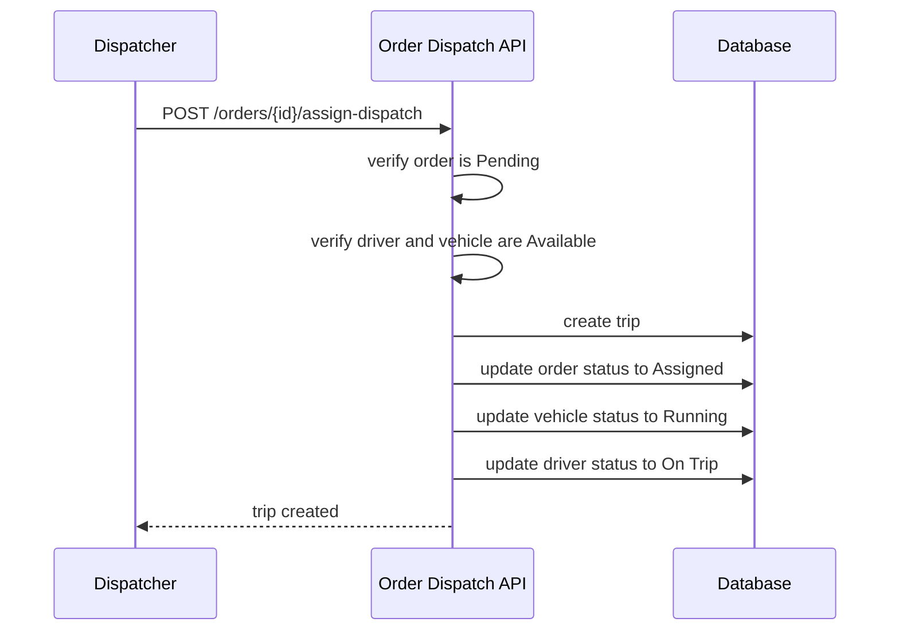
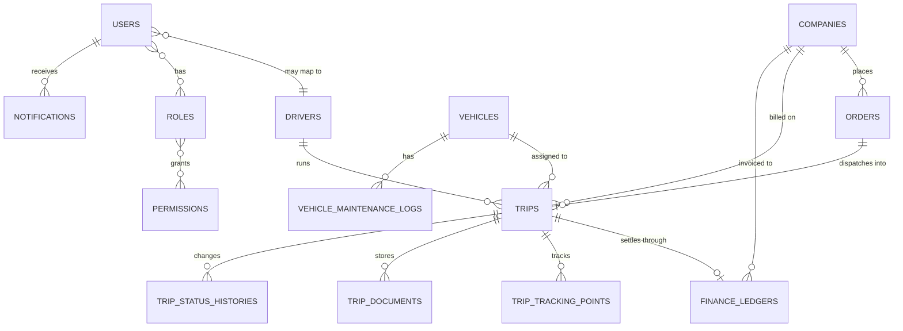

# Logistics TMS Backend API and Architecture Specification

## Table of Contents

1. [Project Overview](#1-project-overview)
2. [Frontend Coverage Summary](#2-frontend-coverage-summary)
3. [Architecture Principles](#3-architecture-principles)
4. [Roles and Authorization](#4-roles-and-authorization)
5. [Core Domain Model](#5-core-domain-model)
6. [Module Analysis](#6-module-analysis)
7. [API Standards](#7-api-standards)
8. [API Specification](#8-api-specification)
9. [Database Design](#9-database-design)
10. [Business Logic Workflows](#10-business-logic-workflows)
11. [Validation Rules](#11-validation-rules)
12. [Authentication and Session Flow](#12-authentication-and-session-flow)
13. [Reports and Analytics Requirements](#13-reports-and-analytics-requirements)
14. [File Upload Requirements](#14-file-upload-requirements)
15. [Notifications and Alerts](#15-notifications-and-alerts)
16. [Dashboard Data Requirements](#16-dashboard-data-requirements)
17. [API Dependency Mapping](#17-api-dependency-mapping)
18. [ERD Description](#18-erd-description)
19. [Assumptions and Recommendations](#19-assumptions-and-recommendations)
20. [Backend Development Order](#20-backend-development-order)

## 1. Project Overview

This frontend represents a Transport Management System (TMS) for a logistics operator. The platform manages:

- client companies
- vehicles and compliance documents
- drivers and license compliance
- order intake
- trip dispatching
- live tracking and driver workflow
- trip finance and receivables
- dashboards, BI reports, and exports

The real business lifecycle exposed by the UI is:

1. Operations or dispatcher creates a transport order for a client.
2. Pickup and destination are chosen, optionally from Google Maps exact place suggestions.
3. Dispatcher assigns an available vehicle and available driver, which creates a trip.
4. Driver accepts the trip, starts it with pickup proof and odometer, then completes it with delivery proof and POD.
5. Trip completion updates order, driver, vehicle, and finance state.
6. Finance reviews revenue, expenses, profit, and payment collection.
7. Admin and managers review dashboards and analytical reports by date range.

The frontend currently uses React Query and a mock REST adapter, but the backend should be implemented as Laravel + MySQL with token-based API authentication and role-based authorization.

## 2. Frontend Coverage Summary

The backend must support the following frontend areas:

| Area | Frontend routes |
| --- | --- |
| Authentication | `/login` |
| Dashboard | `/dashboard` |
| Companies | `/companies`, `/companies/:id` |
| Vehicles | `/vehicles`, `/vehicles/:id` |
| Drivers | `/drivers`, `/drivers/:id`, `/driver-profile` |
| Orders | `/orders` |
| Trips | `/trips`, `/trips/:id`, `/driver-trip` |
| Finance | `/finance` |
| Reports & BI | `/reports` and nested report pages |

Key shared frontend behaviors that imply backend requirements:

- global bearer token support via `Authorization: Bearer <token>`
- list searching, sorting, and pagination
- exact pickup and destination storage using Google Place IDs and coordinates
- active vs history separation for orders and trips
- trip lifecycle status transitions
- trip-linked media uploads
- profit and ledger views at trip, vehicle, driver, company, and route level
- report filters by preset date ranges and custom date range
- CSV, Excel, and print-oriented report outputs

## 3. Architecture Principles

Recommended backend architecture:

- Laravel 12+ API-only application
- MySQL 8+
- Laravel Sanctum or Passport for token authentication
- Spatie Laravel Permission for RBAC
- Service layer for business workflows
- Form Request classes for validation
- API Resources for response formatting
- queued notifications and report exports
- event-driven side effects for trip lifecycle changes

Recommended layers:

- Controllers: thin HTTP entrypoints
- Services: workflow logic and status transitions
- Repositories or query services: report and dashboard aggregation
- Policies and middleware: authorization
- Jobs and events: notifications, report exports, async media processing

## 4. Roles and Authorization

Frontend role model:

- Super Admin
- Operations Manager
- Dispatcher
- Finance Manager
- Driver

Observed menu and workflow permissions:

| Module | Super Admin | Operations Manager | Dispatcher | Finance Manager | Driver |
| --- | --- | --- | --- | --- | --- |
| Dashboard | Yes | Yes | Yes | Yes | No |
| Companies | Yes | Yes | Yes | Yes | No |
| Vehicles | Yes | Yes | No | No | No |
| Drivers | Yes | Yes | No | No | No |
| Orders | Yes | Yes | Yes | No | No |
| Trips | Yes | Yes | Yes | No | Driver only via own workflow |
| Finance | Yes | No | No | Yes | No |
| Reports | Yes | Yes | No | Yes | No |
| Driver profile/workflow | No | No | No | No | Yes |

Required backend authorization model:

- `users`
- `roles`
- `permissions`
- `model_has_roles`
- `model_has_permissions`

Suggested permission groups:

- `dashboard.view`
- `companies.view`, `companies.create`, `companies.update`, `companies.delete`
- `vehicles.view`, `vehicles.create`, `vehicles.update`, `vehicles.delete`, `vehicles.maintenance.manage`
- `drivers.view`, `drivers.create`, `drivers.update`, `drivers.delete`
- `orders.view`, `orders.create`, `orders.update`, `orders.assign`, `orders.cancel`
- `trips.view`, `trips.create`, `trips.update`, `trips.cancel`, `trips.force_complete`, `trips.track`
- `driver_trips.view_own`, `driver_trips.accept_own`, `driver_trips.start_own`, `driver_trips.complete_own`
- `finance.view`, `finance.update`
- `reports.view`
- `notifications.view`

Driver restrictions:

- drivers can only access their own profile, active trip, trip history, and trip media actions
- drivers must never see all-company finance or all-fleet reports

## 5. Core Domain Model

Primary business entities:

- User
- Role
- Company
- Vehicle
- Driver
- Order
- Trip
- Trip Tracking Point
- Trip Document
- Finance Ledger
- Vehicle Maintenance Log
- Notification

Primary relationships:

- one company has many orders
- one company has many trips through orders or direct relation
- one order may create zero or one primary trip in current UI
- one trip belongs to one order
- one trip belongs to one company
- one trip belongs to one vehicle
- one trip belongs to one driver
- one trip has zero or many tracking points
- one trip has zero or many media documents
- one trip has zero or one finance ledger entry in current UI
- one vehicle has many trips and maintenance logs
- one driver has many trips
- one user may map to one driver profile for driver login

## 6. Module Analysis

### 6.1 Authentication

Purpose:

- allow role-based login
- return current user profile and permissions
- support bearer token usage across all API calls

Backend needs:

- login endpoint
- logout endpoint
- me endpoint
- role and permission payload
- optional password reset endpoints even though frontend does not yet expose them

### 6.2 Dashboard

Purpose:

- show operational and financial overview
- show today's dispatch ledger
- show revenue history
- show customer share
- show live running trips
- show compliance alerts

Backend needs:

- dashboard summary endpoint
- today's dispatch endpoint
- live trip locations endpoint
- compliance alerts endpoint

### 6.3 Companies

Purpose:

- manage client master data
- store billing and payment terms
- show per-company revenue, profit, outstanding, order and trip history

Backend needs:

- CRUD
- uniqueness validation for GST and email
- company detail aggregates

### 6.4 Vehicles

Purpose:

- manage fleet assets and compliance metadata
- track status, GPS device, permits, insurance, and maintenance
- show vehicle-level trip profit ledger

Backend needs:

- CRUD
- compliance expiry checks
- maintenance log endpoints
- vehicle performance aggregates

### 6.5 Drivers

Purpose:

- manage driver identity and compliance
- link driver to assigned vehicle
- show driver-level trip profit ledger
- provide driver-only workflow access

Backend needs:

- CRUD
- driver-to-user mapping
- compliance expiry checks
- driver trip summaries

### 6.6 Orders

Purpose:

- capture transport demand from clients
- store route, cargo, priority, delivery deadline, and notes
- optionally persist exact Google Maps pickup and destination points
- separate active orders from historical ones

Backend needs:

- CRUD with status model
- assign-and-dispatch action
- search and filter by status, company, route, due date

### 6.7 Trips

Purpose:

- operational execution record for each dispatch
- manage trip states: Assigned, Running, Delivered, Completed, Cancelled
- store odometer, ETA, remaining distance, photos, POD, and live location
- separate active trips from history

Backend needs:

- CRUD and lifecycle transitions
- driver accept/start/complete endpoints
- force complete and cancel endpoints
- trip detail and live tracking endpoints
- trip status history

### 6.8 GPS Tracking

Purpose:

- render live fleet map and per-trip map
- show current position, route line, ETA, and speed
- support Google route preview and driver/vehicle live monitoring

Backend needs:

- trip current location payload
- trip tracking history endpoint
- optional GPS device integration endpoint/webhook
- ability to store Google route metadata

### 6.9 Finance

Purpose:

- track trip billing and cost breakdown
- derive net profit, profit margin, payment received, pending balance
- allow manual finance corrections

Backend needs:

- trip-linked finance ledger
- auto-generation on trip completion when not present
- edit endpoint with recalculation

### 6.10 Reports

Purpose:

- expose dashboards and BI outputs across trips, revenue, expenses, profit, vehicles, drivers, companies, routes, fleet, and period comparison

Backend needs:

- reusable analytics query layer
- endpoints with preset and custom date filters
- export-ready result formats

### 6.11 Settings

No dedicated settings page exists in the current frontend. Backend should still support:

- user profile
- role metadata
- notification preferences
- optional Google Maps configuration visibility

This can be deferred until a settings UI exists.

## 7. API Standards

Recommended API conventions:

- Base path: `/api/v1`
- Auth: bearer token
- Pagination: Laravel paginator with `page`, `per_page`
- Sort params: `sort_by`, `sort_dir`
- Search param: `search`
- Date filters: `date_from`, `date_to`
- Standard success wrapper:

```json
{
  "success": true,
  "message": "Trip created successfully",
  "data": {},
  "meta": {}
}
```

- Standard error wrapper:

```json
{
  "success": false,
  "message": "Validation failed",
  "errors": {
    "pickup_location": [
      "The pickup location field is required."
    ]
  }
}
```

Important note:

The current frontend services call `/api/companies`, `/api/vehicles`, etc. For production, either:

- update frontend service URLs to `/api/v1/...`, or
- expose versionless aliases that forward to versioned routes

## 8. API Specification

### 8.1 Authentication APIs

| Method | URL | Purpose | Auth | Roles |
| --- | --- | --- | --- | --- |
| POST | `/api/v1/auth/login` | authenticate user | No | All |
| POST | `/api/v1/auth/logout` | revoke current token | Yes | All |
| GET | `/api/v1/auth/me` | current user profile, role, permissions | Yes | All |
| POST | `/api/v1/auth/forgot-password` | start reset flow | No | All |
| POST | `/api/v1/auth/reset-password` | complete reset flow | No | All |

`POST /auth/login` request:

```json
{
  "email": "dispatcher@example.com",
  "password": "secret",
  "device_name": "web"
}
```

`GET /auth/me` response should include:

- user id, name, email, avatar
- active role
- all roles
- permission list
- linked `driver_id` when user is a driver

### 8.2 Dashboard APIs

| Method | URL | Purpose |
| --- | --- | --- |
| GET | `/api/v1/dashboard/summary` | top KPI cards |
| GET | `/api/v1/dashboard/today-dispatches` | today's orders ledger |
| GET | `/api/v1/dashboard/revenue-trend` | monthly revenue vs expense series |
| GET | `/api/v1/dashboard/customer-share` | company trip share |
| GET | `/api/v1/dashboard/live-trips` | live fleet map payload |
| GET | `/api/v1/dashboard/compliance-alerts` | expiring compliance and operational alerts |
| GET | `/api/v1/dashboard/recent-activity` | recent dispatch activity log |

Common filters:

- `date_from`
- `date_to`
- `company_id`
- `vehicle_id`
- `driver_id`

### 8.3 Company APIs

| Method | URL | Purpose |
| --- | --- | --- |
| GET | `/api/v1/companies` | paginated list |
| POST | `/api/v1/companies` | create company |
| GET | `/api/v1/companies/{id}` | company detail |
| PUT | `/api/v1/companies/{id}` | update company |
| DELETE | `/api/v1/companies/{id}` | soft delete or archive |
| GET | `/api/v1/companies/{id}/orders` | company orders |
| GET | `/api/v1/companies/{id}/trips` | company trips |
| GET | `/api/v1/companies/{id}/finance-summary` | revenue/outstanding/profit summary |

Create/update request fields:

```json
{
  "name": "Amazon India",
  "gst": "29AAACA1234A1Z1",
  "address": "Outer Ring Road, Bangalore, Karnataka",
  "contact_person": "Ankit Sharma",
  "phone": "9876543210",
  "email": "shipping@amazon.in",
  "payment_terms": "Net 30",
  "status": "Active"
}
```

Business rules:

- GST must be unique
- company cannot be permanently deleted if linked records exist
- inactive companies can remain visible in historical trips and finance

### 8.4 Vehicle APIs

| Method | URL | Purpose |
| --- | --- | --- |
| GET | `/api/v1/vehicles` | paginated list |
| POST | `/api/v1/vehicles` | create vehicle |
| GET | `/api/v1/vehicles/{id}` | vehicle detail |
| PUT | `/api/v1/vehicles/{id}` | update vehicle |
| DELETE | `/api/v1/vehicles/{id}` | archive vehicle |
| PATCH | `/api/v1/vehicles/{id}/status` | change operational status |
| GET | `/api/v1/vehicles/{id}/trips` | all trips for vehicle |
| GET | `/api/v1/vehicles/{id}/finance-ledger` | trip-wise revenue/profit ledger |
| GET | `/api/v1/vehicles/{id}/maintenance-logs` | maintenance history |
| POST | `/api/v1/vehicles/{id}/maintenance-logs` | add maintenance record |

Vehicle payload:

```json
{
  "number": "KA-03-MM-7890",
  "type": "Tata Ace",
  "capacity": "1.5 Tons",
  "fuel_type": "Diesel",
  "rc_number": "RC-KA03MM7890",
  "insurance_number": "INS-998811",
  "fitness_expiry_date": "2027-12-15",
  "permit_type": "National",
  "pollution_expiry_date": "2026-10-15",
  "gps_device_id": "GPS-ACE-001",
  "status": "Available"
}
```

Business rules:

- vehicle number unique
- GPS device id unique if provided
- running vehicles cannot be set to maintenance unless trip is cancelled/completed
- archive should be blocked if an active trip exists

### 8.5 Driver APIs

| Method | URL | Purpose |
| --- | --- | --- |
| GET | `/api/v1/drivers` | paginated list |
| POST | `/api/v1/drivers` | create driver |
| GET | `/api/v1/drivers/{id}` | driver detail |
| PUT | `/api/v1/drivers/{id}` | update driver |
| DELETE | `/api/v1/drivers/{id}` | archive driver |
| PATCH | `/api/v1/drivers/{id}/status` | change duty status |
| GET | `/api/v1/drivers/{id}/trips` | trip history |
| GET | `/api/v1/drivers/{id}/finance-ledger` | trip-wise revenue/profit ledger |

Driver payload:

```json
{
  "name": "Rajesh Kumar",
  "mobile": "9876500111",
  "license_number": "DL-122015004321",
  "license_expiry_date": "2030-05-14",
  "aadhaar_number": "1234-5678-9012",
  "emergency_contact": "9876500112 (Wife)",
  "assigned_vehicle_number": "MH-12-QW-5689",
  "status": "Available"
}
```

Business rules:

- mobile unique
- license number unique
- aadhaar unique
- assigned vehicle should reference a valid vehicle if normalized mapping is used
- driver cannot be marked available while having active assigned trip

### 8.6 Order APIs

| Method | URL | Purpose |
| --- | --- | --- |
| GET | `/api/v1/orders` | list orders |
| POST | `/api/v1/orders` | create order |
| GET | `/api/v1/orders/{id}` | order detail |
| PUT | `/api/v1/orders/{id}` | update order |
| DELETE | `/api/v1/orders/{id}` | archive order |
| POST | `/api/v1/orders/{id}/assign-dispatch` | assign vehicle + driver and create trip |
| PATCH | `/api/v1/orders/{id}/status` | change order status when needed |

Order creation payload:

```json
{
  "company_id": "CMP-001",
  "pickup_location": "Pune, Maharashtra, India",
  "destination": "Mumbai, Maharashtra, India",
  "pickup_place_id": "google-place-id-1",
  "destination_place_id": "google-place-id-2",
  "pickup_latitude": 18.5204,
  "pickup_longitude": 73.8567,
  "destination_latitude": 19.076,
  "destination_longitude": 72.8777,
  "route_source": "Google Maps",
  "route_distance_km": 150,
  "route_distance_text": "150 km",
  "route_duration_hours": 4,
  "route_duration_text": "4 hours",
  "material": "Electronics",
  "weight": 8.4,
  "vehicle_requirement": "Tata 407",
  "priority": "High",
  "delivery_date": "2026-08-02",
  "notes": "Express courier load delivery."
}
```

Allowed order statuses:

- Pending
- Assigned
- Running
- Delivered
- Completed
- Cancelled

Assign-and-dispatch request:

```json
{
  "vehicle_id": "VEH-003",
  "driver_id": "DRV-003",
  "distance": 350,
  "estimated_duration": 8
}
```

Business rules:

- pickup and destination must differ
- when Google route is used, exact place id and coordinates should be stored
- only available driver and vehicle can be assigned
- assigning an order creates a trip and changes order status to `Assigned`
- active orders view should return non-closed statuses
- history orders view should return `Delivered`, `Completed`, `Cancelled`

### 8.7 Trip APIs

| Method | URL | Purpose |
| --- | --- | --- |
| GET | `/api/v1/trips` | list trips |
| POST | `/api/v1/trips` | direct trip creation |
| GET | `/api/v1/trips/{id}` | trip detail |
| PUT | `/api/v1/trips/{id}` | generic update |
| DELETE | `/api/v1/trips/{id}` | archive trip |
| PATCH | `/api/v1/trips/{id}/accept` | driver accepts assigned trip |
| PATCH | `/api/v1/trips/{id}/start` | start trip with odometer and pickup photo |
| PATCH | `/api/v1/trips/{id}/mark-delivered` | mark reached destination |
| PATCH | `/api/v1/trips/{id}/complete` | complete trip with end odometer and media |
| PATCH | `/api/v1/trips/{id}/cancel` | cancel trip |
| PATCH | `/api/v1/trips/{id}/force-complete` | operations/admin force complete |
| POST | `/api/v1/trips/{id}/tracking-points` | add live GPS point |
| GET | `/api/v1/trips/{id}/tracking-points` | tracking history |
| GET | `/api/v1/trips/{id}/documents` | list trip documents |
| POST | `/api/v1/trips/{id}/documents` | upload pickup/delivery/POD files |
| GET | `/api/v1/trips/active` | active trips only |
| GET | `/api/v1/trips/history` | closed trips only |
| GET | `/api/v1/drivers/me/active-trip` | current driver's active trip |

Trip create payload:

```json
{
  "order_id": "ORD-1001",
  "company_id": "CMP-001",
  "vehicle_id": "VEH-003",
  "driver_id": "DRV-003",
  "pickup_location": "Chennai, Tamil Nadu, India",
  "destination": "Bangalore, Karnataka, India",
  "pickup_place_id": "google-place-id-1",
  "destination_place_id": "google-place-id-2",
  "pickup_latitude": 13.0827,
  "pickup_longitude": 80.2707,
  "destination_latitude": 12.9716,
  "destination_longitude": 77.5946,
  "route_source": "Google Maps",
  "route_distance_text": "350 km",
  "route_duration_text": "8 hours",
  "material": "Electronics",
  "weight": 8.4,
  "distance": 350,
  "estimated_duration": 8,
  "delivery_date": "2026-08-02",
  "remarks": "Trip scheduled by operations desk."
}
```

Driver accept payload:

```json
{
  "remarks": "Trip accepted by driver. Moving to loading point."
}
```

Driver start payload:

```json
{
  "start_odometer": 34500,
  "pickup_photo_file_id": "media-id-1",
  "remarks": "Cargo loaded. Transit in progress."
}
```

Driver complete payload:

```json
{
  "end_odometer": 34650,
  "delivery_photo_file_id": "media-id-2",
  "pod_file_id": "media-id-3",
  "remarks": "Cargo successfully delivered. Consignment closed."
}
```

Trip response should include:

- trip identifiers
- company, driver, vehicle references
- route text and exact coordinates
- status
- odometer data
- delivery dates
- media URLs
- current location, speed, ETA, remaining distance, last updated

Trip lifecycle rules:

- new dispatched trip starts as `Assigned`
- driver accept changes to `Running`
- trip cannot start without valid start odometer and pickup proof
- trip cannot complete without higher end odometer and both delivery photo and POD
- trip completion releases vehicle and driver
- trip completion updates linked order to delivered/completed state
- trip completion auto-creates finance ledger if missing
- cancelling trip releases vehicle and driver and marks order cancelled

### 8.8 GPS and Tracking APIs

| Method | URL | Purpose |
| --- | --- | --- |
| GET | `/api/v1/tracking/live-fleet` | live running trips with location |
| GET | `/api/v1/trips/{id}/tracking-points` | timeline for one trip |
| POST | `/api/v1/trips/{id}/tracking-points` | ingest manual/app/GPS device location |
| POST | `/api/v1/gps/webhooks/device-update` | optional integration for GPS vendors |

Tracking point payload:

```json
{
  "latitude": 18.75,
  "longitude": 73.40,
  "speed_kmph": 62,
  "eta_text": "1.5 hrs",
  "remaining_distance_km": 68,
  "recorded_at": "2026-08-01T10:30:00+05:30",
  "source": "driver_app"
}
```

### 8.9 Finance APIs

| Method | URL | Purpose |
| --- | --- | --- |
| GET | `/api/v1/finances` | list ledger entries |
| POST | `/api/v1/finances` | create ledger entry |
| GET | `/api/v1/finances/{id}` | detail |
| PUT | `/api/v1/finances/{id}` | update ledger |
| DELETE | `/api/v1/finances/{id}` | archive ledger |
| GET | `/api/v1/finances/summary` | finance totals |
| GET | `/api/v1/trips/{id}/finance` | trip-linked finance detail |

Finance payload:

```json
{
  "trip_id": "TRP-1001",
  "company_id": "CMP-001",
  "invoice_number": "INV-5001",
  "trip_amount": 8250,
  "diesel_expense": 2475,
  "toll_expense": 330,
  "driver_allowance": 300,
  "loading_charge": 800,
  "unloading_charge": 700,
  "other_expenses": 350,
  "payment_received": 2000,
  "remarks": "Diesel slips matched."
}
```

Recalculated backend fields:

- `total_expenses`
- `pending_amount`
- `net_profit`
- `profit_margin`
- `status` (`Paid`, `Partial`, `Pending`)

### 8.10 Notifications APIs

| Method | URL | Purpose |
| --- | --- | --- |
| GET | `/api/v1/notifications` | list user notifications |
| POST | `/api/v1/notifications/mark-all-read` | mark read |
| DELETE | `/api/v1/notifications` | clear user notifications |

### 8.11 Reports and BI APIs

The frontend currently derives BI client-side, but production backend should expose report-ready endpoints to reduce payload size and improve performance.

Suggested endpoints:

| Method | URL | Purpose |
| --- | --- | --- |
| GET | `/api/v1/reports/executive` | executive dashboard |
| GET | `/api/v1/reports/trips` | trip analytics |
| GET | `/api/v1/reports/vehicles` | vehicle analytics |
| GET | `/api/v1/reports/drivers` | driver analytics |
| GET | `/api/v1/reports/companies` | company analytics |
| GET | `/api/v1/reports/revenue` | revenue analytics |
| GET | `/api/v1/reports/expenses` | expense analytics |
| GET | `/api/v1/reports/profit` | profit analytics |
| GET | `/api/v1/reports/fleet` | fleet analytics |
| GET | `/api/v1/reports/driver-utilization` | driver utilization |
| GET | `/api/v1/reports/routes` | route analytics |
| GET | `/api/v1/reports/comparison` | current vs previous period comparison |
| GET | `/api/v1/reports/export/{report}` | downloadable CSV/XLSX |

Common report filters:

- `range=today|yesterday|this_week|last_week|this_month|last_month|quarter|year|custom`
- `start_date`
- `end_date`
- `company_id`
- `vehicle_id`
- `driver_id`
- `status`

## 9. Database Design

### 9.1 users

| Column | Type | Notes |
| --- | --- | --- |
| id | bigint unsigned PK | |
| name | varchar(150) | |
| email | varchar(150) unique | |
| password | varchar(255) | |
| avatar_url | varchar(500) nullable | |
| driver_id | bigint unsigned nullable FK | for driver login |
| is_active | tinyint(1) | default 1 |
| last_login_at | timestamp nullable | |
| created_at | timestamp | |
| updated_at | timestamp | |

### 9.2 roles / permissions

Use Spatie standard tables:

- roles
- permissions
- model_has_roles
- model_has_permissions
- role_has_permissions

### 9.3 companies

| Column | Type | Notes |
| --- | --- | --- |
| id | bigint unsigned PK | |
| code | varchar(30) unique | display code like CMP-001 |
| name | varchar(200) | |
| gst | varchar(20) unique | |
| address | text | |
| contact_person | varchar(150) | |
| phone | varchar(20) | |
| email | varchar(150) | |
| payment_terms | varchar(30) | `Net 15`, `Net 30`, `Net 45`, `Net 60`, `COD` |
| status | enum | `Active`, `Inactive` |
| deleted_at | timestamp nullable | soft delete |
| created_at | timestamp | |
| updated_at | timestamp | |

Indexes:

- unique on `gst`
- index on `name`
- index on `status`

### 9.4 vehicles

| Column | Type | Notes |
| --- | --- | --- |
| id | bigint unsigned PK | |
| code | varchar(30) unique | |
| number | varchar(30) unique | registration |
| type | varchar(100) | |
| capacity | decimal(10,2) nullable | store numeric tons if possible |
| capacity_label | varchar(50) nullable | original display text |
| fuel_type | enum | Diesel, CNG, Electric, Petrol |
| rc_number | varchar(100) unique | |
| insurance_number | varchar(100) unique | |
| fitness_expiry_date | date | |
| permit_type | enum | National, State, Local |
| pollution_expiry_date | date | |
| gps_device_id | varchar(100) unique nullable | |
| status | enum | Available, Running, Maintenance, Inactive |
| deleted_at | timestamp nullable | |
| created_at | timestamp | |
| updated_at | timestamp | |

Indexes:

- unique on `number`
- unique on `gps_device_id`
- index on `status`
- index on compliance dates

### 9.5 drivers

| Column | Type | Notes |
| --- | --- | --- |
| id | bigint unsigned PK | |
| code | varchar(30) unique | |
| name | varchar(150) | |
| mobile | varchar(20) unique | |
| license_number | varchar(100) unique | |
| license_expiry_date | date | |
| aadhaar_number | varchar(20) unique | |
| emergency_contact | varchar(150) | |
| assigned_vehicle_id | bigint unsigned nullable FK | preferred normalized approach |
| rating | decimal(3,2) default 5.00 | |
| status | enum | Available, On Trip, Leave, Offline |
| deleted_at | timestamp nullable | |
| created_at | timestamp | |
| updated_at | timestamp | |

Indexes:

- unique on `mobile`
- unique on `license_number`
- unique on `aadhaar_number`
- index on `status`
- index on `assigned_vehicle_id`

### 9.6 orders

| Column | Type | Notes |
| --- | --- | --- |
| id | bigint unsigned PK | |
| code | varchar(30) unique | ORD-xxxx |
| company_id | bigint unsigned FK | |
| pickup_location | varchar(255) | exact address text |
| destination | varchar(255) | exact address text |
| pickup_place_id | varchar(120) nullable | Google place id |
| destination_place_id | varchar(120) nullable | Google place id |
| pickup_latitude | decimal(10,7) nullable | |
| pickup_longitude | decimal(10,7) nullable | |
| destination_latitude | decimal(10,7) nullable | |
| destination_longitude | decimal(10,7) nullable | |
| route_source | varchar(50) nullable | Google Maps / manual |
| route_distance_km | decimal(10,2) nullable | |
| route_distance_text | varchar(50) nullable | |
| route_duration_hours | decimal(10,2) nullable | |
| route_duration_text | varchar(50) nullable | |
| material | varchar(150) | |
| weight | decimal(10,2) | tons |
| vehicle_requirement | varchar(100) | |
| priority | enum | Medium, High |
| delivery_date | date | |
| notes | text nullable | |
| status | enum | Pending, Assigned, Running, Delivered, Completed, Cancelled |
| deleted_at | timestamp nullable | |
| created_at | timestamp | |
| updated_at | timestamp | |

Indexes:

- index on `company_id`
- index on `status`
- index on `delivery_date`
- composite index on route coordinates if geo filtering is needed later

### 9.7 trips

| Column | Type | Notes |
| --- | --- | --- |
| id | bigint unsigned PK | |
| code | varchar(30) unique | TRP-xxxx |
| order_id | bigint unsigned FK | nullable if created standalone |
| company_id | bigint unsigned FK | |
| vehicle_id | bigint unsigned FK | |
| driver_id | bigint unsigned FK | |
| pickup_location | varchar(255) | |
| destination | varchar(255) | |
| pickup_place_id | varchar(120) nullable | |
| destination_place_id | varchar(120) nullable | |
| pickup_latitude | decimal(10,7) nullable | |
| pickup_longitude | decimal(10,7) nullable | |
| destination_latitude | decimal(10,7) nullable | |
| destination_longitude | decimal(10,7) nullable | |
| route_source | varchar(50) nullable | |
| route_distance_text | varchar(50) nullable | |
| route_duration_text | varchar(50) nullable | |
| material | varchar(150) | |
| weight | decimal(10,2) | |
| distance | decimal(10,2) | km |
| estimated_duration | decimal(10,2) | hours |
| remarks | text nullable | |
| status | enum | Assigned, Running, Delivered, Completed, Cancelled |
| pickup_date | date nullable | |
| delivery_date | date nullable | |
| start_odometer | integer unsigned nullable | |
| end_odometer | integer unsigned nullable | |
| is_delayed | tinyint(1) default 0 | |
| current_latitude | decimal(10,7) nullable | denormalized quick access |
| current_longitude | decimal(10,7) nullable | |
| speed_kmph | decimal(8,2) nullable | |
| eta_text | varchar(50) nullable | |
| remaining_distance_km | decimal(10,2) nullable | |
| last_tracked_at | timestamp nullable | |
| deleted_at | timestamp nullable | |
| created_at | timestamp | |
| updated_at | timestamp | |

Indexes:

- index on `order_id`
- index on `company_id`
- index on `vehicle_id`
- index on `driver_id`
- index on `status`
- index on `pickup_date`

### 9.8 trip_status_histories

| Column | Type | Notes |
| --- | --- | --- |
| id | bigint unsigned PK | |
| trip_id | bigint unsigned FK | |
| from_status | varchar(30) nullable | |
| to_status | varchar(30) | |
| remarks | text nullable | |
| changed_by_user_id | bigint unsigned nullable FK | |
| changed_at | timestamp | |

### 9.9 trip_tracking_points

| Column | Type | Notes |
| --- | --- | --- |
| id | bigint unsigned PK | |
| trip_id | bigint unsigned FK | |
| latitude | decimal(10,7) | |
| longitude | decimal(10,7) | |
| speed_kmph | decimal(8,2) nullable | |
| eta_text | varchar(50) nullable | |
| remaining_distance_km | decimal(10,2) nullable | |
| source | varchar(30) | driver_app, gps_device, admin |
| recorded_at | timestamp | |
| created_at | timestamp | |
| updated_at | timestamp | |

Indexes:

- composite index on `(trip_id, recorded_at)`

### 9.10 trip_documents

| Column | Type | Notes |
| --- | --- | --- |
| id | bigint unsigned PK | |
| trip_id | bigint unsigned FK | |
| document_type | enum | pickup_photo, delivery_photo, pod |
| file_name | varchar(255) | |
| file_path | varchar(500) | |
| mime_type | varchar(100) | |
| file_size_bytes | bigint unsigned | |
| uploaded_by_user_id | bigint unsigned nullable FK | |
| created_at | timestamp | |
| updated_at | timestamp | |

### 9.11 finance_ledgers

| Column | Type | Notes |
| --- | --- | --- |
| id | bigint unsigned PK | |
| code | varchar(30) unique | FIN-xxxx |
| trip_id | bigint unsigned FK unique | one ledger per trip in current UI |
| company_id | bigint unsigned FK | |
| invoice_number | varchar(50) unique | |
| trip_amount | decimal(12,2) | |
| diesel_expense | decimal(12,2) default 0 | |
| toll_expense | decimal(12,2) default 0 | |
| driver_allowance | decimal(12,2) default 0 | |
| loading_charge | decimal(12,2) default 0 | |
| unloading_charge | decimal(12,2) default 0 | |
| other_expenses | decimal(12,2) default 0 | |
| total_expenses | decimal(12,2) | calculated |
| payment_received | decimal(12,2) default 0 | |
| pending_amount | decimal(12,2) | calculated |
| net_profit | decimal(12,2) | calculated |
| profit_margin | decimal(8,2) | calculated percent |
| status | enum | Paid, Partial, Pending |
| recorded_at | date | |
| remarks | text nullable | |
| created_at | timestamp | |
| updated_at | timestamp | |

Indexes:

- unique on `trip_id`
- unique on `invoice_number`
- index on `company_id`
- index on `status`
- index on `recorded_at`

### 9.12 vehicle_maintenance_logs

| Column | Type | Notes |
| --- | --- | --- |
| id | bigint unsigned PK | |
| vehicle_id | bigint unsigned FK | |
| service_date | date | |
| service_type | varchar(150) | |
| cost | decimal(12,2) | |
| technician | varchar(150) nullable | |
| status | varchar(30) | default `Completed` |
| notes | text nullable | |
| created_by_user_id | bigint unsigned nullable FK | |
| created_at | timestamp | |
| updated_at | timestamp | |

### 9.13 notifications

| Column | Type | Notes |
| --- | --- | --- |
| id | bigint unsigned PK | |
| user_id | bigint unsigned FK nullable | per-user or broadcast |
| type | enum | info, warning, error, success |
| title | varchar(150) nullable | |
| message | text | |
| related_type | varchar(50) nullable | trip, vehicle, driver |
| related_id | bigint unsigned nullable | polymorphic reference if needed |
| read_at | timestamp nullable | |
| created_at | timestamp | |
| updated_at | timestamp | |

## 10. Business Logic Workflows

### 10.1 Create Order



Rules:

- company must exist and be active unless override policy exists
- pickup and destination cannot be the same
- if Google Maps route used, place ids and coordinates should be stored exactly
- order starts as `Pending`

### 10.2 Assign Driver and Vehicle



### 10.3 Driver Accept Trip

Rules:

- only assigned driver may accept own trip
- only `Assigned` trips can be accepted
- accepted trip becomes `Running`
- status history entry must be written

### 10.4 Start Trip

Rules:

- only assigned driver may start own trip
- requires `start_odometer > 0`
- requires pickup inspection photo
- updates current location and speed if provided
- does not create finance yet

### 10.5 Mark Delivered

Rules:

- running trip can become `Delivered`
- used as intermediate state before POD confirmation

### 10.6 Complete Trip

Rules:

- allowed from `Running` or `Delivered`
- end odometer must be greater than start odometer
- requires delivery photo and POD
- order becomes `Delivered` or `Completed` according to chosen final state convention
- vehicle becomes `Available`
- driver becomes `Available`
- finance ledger auto-created if not already present

### 10.7 Cancel Trip

Rules:

- only allowed for authorized operational roles
- trip becomes `Cancelled`
- vehicle and driver are released
- linked order becomes `Cancelled`

### 10.8 Finance Entry and Profit Calculation

Rules:

- backend always recalculates totals, pending, profit, and margin
- frontend values should never be trusted for calculated fields
- `status = Paid` when pending is 0
- `status = Partial` when payment received is > 0 and pending > 0
- `status = Pending` when payment received is 0

### 10.9 Compliance and Alert Logic

Generate alerts for:

- vehicle fitness expiry
- vehicle pollution expiry
- vehicle insurance expiry if date is later added
- driver license expiry
- delayed trips
- idle vehicles over threshold

### 10.10 Active vs History Tables

Order history logic:

- active: all statuses except `Delivered`, `Completed`, `Cancelled`
- history: `Delivered`, `Completed`, `Cancelled`

Trip history logic:

- active: all statuses except `Completed`, `Delivered`, `Cancelled`
- history: `Completed`, `Delivered`, `Cancelled`

## 11. Validation Rules

### Authentication

- email required, valid email
- password required

### Company

- `name`: required, max 200
- `gst`: required, unique, valid GSTIN format
- `address`: required
- `contact_person`: required
- `phone`: required, valid Indian mobile pattern
- `email`: required, valid, unique per company if desired
- `payment_terms`: in allowed enum
- `status`: in `Active`, `Inactive`

### Vehicle

- `number`: required, unique, valid Indian registration pattern
- `type`: required
- `capacity`: required, numeric positive
- `fuel_type`: allowed enum
- `rc_number`: required, unique
- `insurance_number`: required, unique
- `fitness_expiry_date`: required, date
- `pollution_expiry_date`: required, date
- `gps_device_id`: required in current UI, unique
- `permit_type`: allowed enum
- `status`: allowed enum

### Driver

- `name`: required
- `mobile`: required, unique, valid Indian mobile pattern
- `license_number`: required, unique
- `license_expiry_date`: required, date
- `aadhaar_number`: required, unique, valid 12-digit or masked pattern
- `emergency_contact`: required
- `status`: allowed enum

### Order

- `company_id`: required, exists
- `pickup_location`: required
- `destination`: required
- `pickup_location != destination`
- `material`: required
- `weight`: required, numeric, positive
- `vehicle_requirement`: required
- `priority`: in `Medium`, `High`
- `delivery_date`: required, valid date, not before today unless special override

Additional Google Maps validation:

- if `pickup_place_id` present, latitude and longitude must also be present
- if `destination_place_id` present, latitude and longitude must also be present
- coordinates must be valid decimal lat/lng values

### Trip

- `company_id`, `vehicle_id`, `driver_id`: required, must exist
- `vehicle_id` must reference available vehicle at creation
- `driver_id` must reference available driver at creation
- `distance`: required, numeric, positive
- `estimated_duration`: required, numeric, positive
- `start_odometer`: required for start flow, integer, positive
- `end_odometer`: required for completion flow, integer, greater than `start_odometer`

### Finance

- `trip_id`: required, exists, unique in ledger
- `invoice_number`: required, unique
- monetary fields: numeric, min 0
- `payment_received <= trip_amount` unless overpayment policy exists

### Maintenance Log

- `service_date`: required, date
- `service_type`: required
- `cost`: required, numeric, min 0
- `technician`: nullable, max 150

### File Uploads

- file required for relevant flow
- mime type restricted by document type
- size limit enforced

## 12. Authentication and Session Flow

Observed frontend behavior:

- login page currently simulates role login only
- `apiClient` attaches token from `localStorage.getItem('ltms_token')`
- app redirects to `/login` when no user exists in redux state

Production backend flow:

1. `POST /auth/login`
2. backend verifies credentials
3. backend returns token + user + role + permissions
4. frontend stores token and current user
5. every request sends bearer token
6. `GET /auth/me` restores session on reload
7. `POST /auth/logout` revokes token

Recommended login response:

```json
{
  "success": true,
  "data": {
    "token": "plain-text-or-jwt-token",
    "user": {
      "id": 1,
      "name": "Dispatcher User",
      "email": "dispatcher@example.com",
      "avatar_url": null,
      "active_role": "Dispatcher",
      "roles": ["Dispatcher"],
      "permissions": ["orders.view", "orders.create", "orders.assign", "trips.view", "trips.create"],
      "driver_id": null
    }
  }
}
```

## 13. Reports and Analytics Requirements

### Required date filters

- Today
- Yesterday
- This Week
- Last Week
- This Month
- Last Month
- Quarter
- Year
- Custom Date Range

### Executive dashboard requirements

Must provide:

- total trips
- running trips
- completed trips
- cancelled trips
- total revenue
- total expenses
- net profit
- outstanding receivables
- on-time rate
- average revenue per trip
- average cost per trip
- average distance
- average duration
- vehicle utilization
- driver utilization
- monthly revenue and expense trend
- status distribution
- daily trip volume
- company-wise revenue
- fleet utilization distribution
- top driver leaderboard

### Trip analytics requirements

- trip status distribution
- distance buckets
- monthly completed vs cancelled
- pickup frequency
- destination frequency
- most frequent routes
- full trip register

### Vehicle analytics requirements

- utilization by vehicle
- revenue vs profit by vehicle
- rankings: highest revenue, most utilized, most profitable, highest expense, lowest utilization, most trips completed
- vehicle performance register

### Driver analytics requirements

- on-time rate by driver
- distance covered by driver
- rankings: best on-time, highest revenue, most trips, longest distance, highest allowance, top rated
- driver performance register

### Company analytics requirements

- company revenue ranking
- outstanding receivables ranking
- monthly business trend
- rankings for highest revenue, most orders, fastest paying, highest outstanding
- client portfolio register

### Revenue analytics requirements

- daily revenue
- monthly revenue
- revenue forecast
- company/vehicle/driver/route breakdown
- best revenue day

### Expense analytics requirements

- expense category breakdown
- monthly expense trend
- vehicle-wise stacked expenses
- driver allowances
- expense category summary

### Profit analytics requirements

- profit structure by month
- margin trend
- top companies, vehicles, drivers, and routes by profit
- route profitability register

### Fleet analytics requirements

- fleet status mix
- utilization by vehicle
- distance and running hours
- revenue vs expenses by vehicle
- fleet performance register

### Driver utilization requirements

- availability mix
- on-time by driver
- trips completed by driver
- top and bottom driver utilization patterns

### Route analytics requirements

- most popular routes
- distance and duration by corridor
- revenue vs profit by route
- route performance register

### Comparison report requirements

- current vs previous period revenue
- current vs previous period expenses
- current vs previous period net profit
- current vs previous period trips completed
- current vs previous period delayed/cancelled/on-time metrics

### Export requirements

Each report should support:

- JSON API response for UI
- CSV export
- XLSX export
- print-friendly layout or PDF export if later needed

## 14. File Upload Requirements

Current frontend-derived file/media requirements:

| Document | Related entity | Required when | Allowed types | Suggested max size |
| --- | --- | --- | --- | --- |
| Driver photo | driver | future driver profile enhancement | jpg, jpeg, png, webp | 5 MB |
| Driver license scan | driver | future compliance enhancement | pdf, jpg, jpeg, png | 10 MB |
| RC document | vehicle | future compliance enhancement | pdf, jpg, jpeg, png | 10 MB |
| Insurance document | vehicle | future compliance enhancement | pdf, jpg, jpeg, png | 10 MB |
| Pickup photo | trip | trip start | jpg, jpeg, png, webp | 8 MB |
| Delivery photo | trip | trip completion | jpg, jpeg, png, webp | 8 MB |
| POD document | trip | trip completion | pdf, jpg, jpeg, png | 10 MB |

Storage recommendations:

- private object storage or local storage with signed URLs
- folder structure:
  - `drivers/{driver_id}/...`
  - `vehicles/{vehicle_id}/...`
  - `trips/{trip_id}/pickup/`
  - `trips/{trip_id}/delivery/`
  - `trips/{trip_id}/pod/`

Validation recommendations:

- reject oversized files
- virus scan if infrastructure allows
- normalize image orientation
- keep upload audit trail

## 15. Notifications and Alerts

Frontend and dashboard imply these notification events:

- trip assigned
- driver accepted trip
- trip started
- trip delivered
- trip completed
- trip cancelled
- trip delayed
- vehicle assigned
- driver assigned
- vehicle fitness expiring
- driver license expiring
- large outstanding payment

Suggested delivery channels:

- in-app notifications
- optional email or WhatsApp later

Notification payload fields:

- type
- title
- message
- related entity type/id
- severity
- read state
- created timestamp

## 16. Dashboard Data Requirements

### Main dashboard

Cards/widgets:

- Today's Orders
- Active Trips
- Available Drivers
- Total Revenue card that actually displays net profit in current UI
- Today's Orders ledger table
- Revenue History chart
- Customer Share chart
- Live Fleet Tracking map
- Compliance Alerts list
- Recent Activity Log

Required backend data sources:

- `orders`
- `trips`
- `drivers`
- `vehicles`
- `finance_ledgers`
- `trip_tracking_points`

Refresh strategy:

- summary KPIs: every 60-120 seconds
- live fleet map: every 15-30 seconds or WebSocket
- dashboard alerts: every 5 minutes
- activity log: every 60 seconds

### Reports dashboard

All report pages depend on date-windowed aggregates. Backend should cache report queries by:

- report key
- range preset
- start/end date
- tenant or company scope if multi-tenant later

## 17. API Dependency Mapping

| Frontend page | Main component/workflow | Backend endpoint(s) | Controller | Service | Tables |
| --- | --- | --- | --- | --- | --- |
| `/login` | role login / session bootstrap | `POST /auth/login`, `GET /auth/me`, `POST /auth/logout` | `AuthController` | `AuthService` | `users`, role tables |
| `/dashboard` | summary cards | `GET /dashboard/summary` | `DashboardController` | `DashboardService` | `orders`, `trips`, `drivers`, `vehicles`, `finance_ledgers` |
| `/dashboard` | today's orders ledger | `GET /dashboard/today-dispatches` | `DashboardController` | `DashboardService` | `trips`, `orders`, `finance_ledgers` |
| `/dashboard` | live fleet map | `GET /dashboard/live-trips` | `TrackingController` | `TrackingService` | `trips`, `trip_tracking_points` |
| `/companies` | list/search/create/edit/delete | `GET/POST/PUT/DELETE /companies` | `CompanyController` | `CompanyService` | `companies` |
| `/companies/:id` | company detail dashboards | `GET /companies/{id}`, `/orders`, `/trips`, `/finance-summary` | `CompanyController` | `CompanyAnalyticsService` | `companies`, `orders`, `trips`, `finance_ledgers` |
| `/vehicles` | fleet CRUD | `GET/POST/PUT/DELETE /vehicles` | `VehicleController` | `VehicleService` | `vehicles` |
| `/vehicles/:id` | compliance + trip profit table | `GET /vehicles/{id}`, `/trips`, `/finance-ledger`, `/maintenance-logs` | `VehicleController` | `VehicleAnalyticsService` | `vehicles`, `trips`, `finance_ledgers`, `vehicle_maintenance_logs` |
| `/drivers` | driver CRUD | `GET/POST/PUT/DELETE /drivers` | `DriverController` | `DriverService` | `drivers` |
| `/drivers/:id` | compliance + trip profit table | `GET /drivers/{id}`, `/trips`, `/finance-ledger` | `DriverController` | `DriverAnalyticsService` | `drivers`, `trips`, `finance_ledgers` |
| `/orders` | place order | `POST /orders` | `OrderController` | `OrderService` | `orders` |
| `/orders` | assign and dispatch | `POST /orders/{id}/assign-dispatch` | `OrderDispatchController` | `DispatchService` | `orders`, `trips`, `vehicles`, `drivers` |
| `/orders` | active/history list | `GET /orders?status_scope=active|history` | `OrderController` | `OrderQueryService` | `orders` |
| `/trips` | create & dispatch trip | `POST /trips` | `TripController` | `TripService` | `trips`, `vehicles`, `drivers` |
| `/trips` | active/history list | `GET /trips?status_scope=active|history` | `TripController` | `TripQueryService` | `trips` |
| `/trips` | live track modal | `GET /trips/{id}`, `GET /trips/{id}/tracking-points` | `TripController`, `TrackingController` | `TripService`, `TrackingService` | `trips`, `trip_tracking_points` |
| `/trips/:id` | complete/cancel/deliver | `PATCH /trips/{id}/mark-delivered`, `/complete`, `/cancel` | `TripWorkflowController` | `TripWorkflowService` | `trips`, `orders`, `drivers`, `vehicles`, `finance_ledgers` |
| `/driver-trip` | accept trip | `GET /drivers/me/active-trip`, `PATCH /trips/{id}/accept` | `DriverTripController` | `DriverTripService` | `trips`, `drivers` |
| `/driver-trip` | start trip | `PATCH /trips/{id}/start`, `POST /trips/{id}/documents` | `DriverTripController` | `DriverTripService` | `trips`, `trip_documents` |
| `/driver-trip` | complete trip | `PATCH /trips/{id}/complete`, `POST /trips/{id}/documents` | `DriverTripController` | `DriverTripService` | `trips`, `trip_documents`, `finance_ledgers` |
| `/finance` | ledger list and edit | `GET /finances`, `PUT /finances/{id}` | `FinanceController` | `FinanceService` | `finance_ledgers` |
| `/reports/*` | report pages | `GET /reports/...` | `ReportController` | `ReportService` | `trips`, `vehicles`, `drivers`, `companies`, `orders`, `finance_ledgers` |
| global header | notifications | `GET /notifications`, `POST /notifications/mark-all-read`, `DELETE /notifications` | `NotificationController` | `NotificationService` | `notifications` |

## 18. ERD Description



Relationship notes:

- `orders -> trips` is modeled as one-to-many to keep future flexibility, even though the current UI usually creates one trip per order.
- `trips -> finance_ledgers` is one-to-one in the current UI.
- `users -> drivers` is optional and supports driver app login.

## 19. Assumptions and Recommendations

### Assumptions taken from the frontend

- one trip currently belongs to one order
- one finance ledger currently belongs to one trip
- route recommendations come from Google Maps when configured
- exact pickup and destination points must be stored, not just city names
- trip photos/POD are mandatory for proper completion in driver flow
- active and history tables are functionally distinct views

### Recommended implementation decisions

- use soft deletes for master data
- use numeric database ids plus human-readable business codes
- store both route text and coordinates
- make report endpoints server-side aggregated instead of shipping all raw data
- keep trip status history table for auditability
- keep tracking points separate from denormalized current trip location
- use policies for per-role and per-driver access restrictions
- queue notification and export jobs
- add optimistic concurrency or row locking around dispatch assignment to prevent double-booking driver/vehicle

### Frontend/backend alignment recommendation

The frontend currently computes many analytics client-side from raw lists. For scale, the backend should provide both:

- normal CRUD endpoints for operational screens
- aggregated report endpoints for BI screens

## 20. Backend Development Order

Recommended build order:

1. Authentication and RBAC
2. User-to-driver mapping
3. Companies module
4. Vehicles module
5. Drivers module
6. Orders module
7. Trip dispatch and lifecycle module
8. Trip documents and tracking
9. Finance ledger and auto-calculation rules
10. Dashboard summary APIs
11. Notifications and compliance alerts
12. Reports and analytics endpoints
13. Export endpoints
14. Performance optimization, caching, and background jobs

## Appendix: Minimum Query Parameters by List Endpoint

All list endpoints should support:

| Parameter | Purpose |
| --- | --- |
| `page` | pagination page |
| `per_page` | page size |
| `search` | global text search |
| `sort_by` | sort field |
| `sort_dir` | `asc` or `desc` |
| `status` | status filter |
| `date_from` | lower date filter |
| `date_to` | upper date filter |

Module-specific additions:

- orders: `company_id`, `priority`, `status_scope`
- trips: `company_id`, `vehicle_id`, `driver_id`, `status_scope`, `pickup_place_id`, `destination_place_id`
- finances: `company_id`, `payment_status`
- reports: `range`, `start_date`, `end_date`

